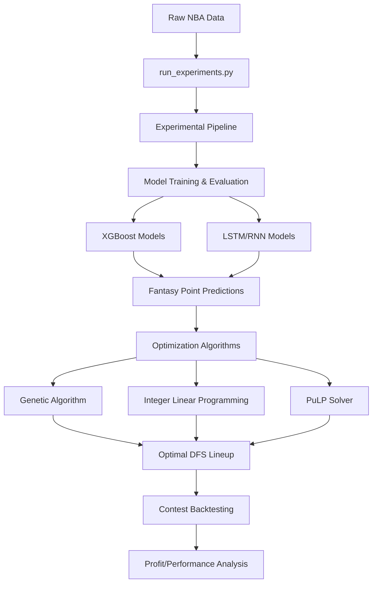

# NBA Daily Fantasy Basketball Predictor 🏀

A comprehensive machine learning pipeline for NBA daily fantasy sports (DFS) that implements advanced prediction models and optimization algorithms to generate profitable lineups. This project represents cutting-edge research in applying temporal machine learning techniques to DFS competitions.

## 🎯 Overview

This project addresses a fundamental research question: **Can advanced ML techniques that capture temporal dependencies in NBA data, combined with sophisticated optimization algorithms, generate consistent profits in DFS tournaments?**

Key innovations include:
- **Temporal Modeling**: Rolling-window training with LSTM/RNN and XGBoost
- **Advanced Feature Engineering**: 900+ features including DvP metrics, cross-season stats, and volatility indicators
- **Multi-Algorithm Optimization**: Genetic algorithms, integer linear programming, and constraint solvers
- **Comprehensive Backtesting**: Evaluation across 8 NBA seasons with real contest data
- **Salary-Based Stratification**: Targeted modeling for high-value players

## 🚀 Quick Start

### Prerequisites
- Python 3.8+
- For Apple Silicon GPU acceleration: PyTorch with MPS support

### Installation
```bash
git clone https://github.com/tzachpach/final_project_dfs.git
cd final_project_dfs
pip install -r requirements.txt
```

### Running the Pipeline
```bash
python src/experiments/run_experiments.py
```

This command initiates the comprehensive experimental pipeline that:
1. Runs multiple ML models (XGBoost, LSTM/RNN) with various configurations
2. Tests different feature engineering strategies
3. Evaluates multiple optimization algorithms
4. Generates performance metrics and comparisons
5. Outputs results for analysis

## 📊 Workflow Architecture



## 🛠️ Core Components

### 1. Experimental Framework (`src/experiments/run_experiments.py`)
- **Main entry point** for the entire pipeline
- Orchestrates systematic testing of different model configurations
- Manages hyperparameter grid searches
- Coordinates model training, evaluation, and comparison

### 2. Data Preprocessing (`src.preprocessing`)
- **`merge_all_seasons()`**: Combines multiple season CSV files
- **`preprocess_all_seasons_data()`**: Standardizes columns and cleans data
- Handles missing values and inconsistent formatting

### 3. Feature Engineering (`src.data_enrichment`)
- **`add_time_dependent_features_v2()`**: 
  - Rolling averages (3, 5, 10 game windows)
  - Performance differentials
  - Trend indicators
  - Volatility metrics
- **`add_running_season_stats()`**: Cumulative season statistics
- **`add_last_season_data_with_extras()`**: Cross-season continuity features
- **Defense vs Position (DvP)** metrics for matchup analysis

### 4. Prediction Models

#### XGBoost
- **Module**: `src.predict_fp_xgb_daily`
- **Features**: 
  - Daily and weekly rolling predictions
  - Salary quantile binning (top 10%, 25%, etc.)
  - Multi-target vs single-target modes
  - Feature reduction strategies (SelectKBest, PCA)

#### LSTM/RNN
- **Module**: `src.predict_fp_rnn_*`
- **Features**:
  - Sequential modeling with lookback windows
  - Per-player scaling
  - Hyperparameter tuning for architecture
  - Multi-target prediction capability

### 5. Lineup Optimization
- **Genetic Algorithm** (`src.lineup_genetic_optimizer`)
  - Population-based optimization
  - Custom mutation/crossover strategies
  - Constraint-aware evolution
- **Integer Linear Programming** (ILP)
  - Google OR-Tools implementation
  - Guaranteed optimal solutions
  - Exact constraint modeling
- **PuLP Solver**
  - Alternative ILP implementation
  - Enhanced debugging capabilities

## 📈 Contest Outcome Analysis

The pipeline includes comprehensive backtesting against real DFS contest data to evaluate profitability:

### Setup
1. Ensure you have contest data: `fanduel_nba_contests.csv`
2. Generated lineups from the experimental pipeline
3. Run analysis scripts or notebooks for performance evaluation

### Key Metrics
- **Win Rate**: Percentage of contests where lineup would've won
- **Cash Rate**: Percentage of contests where lineup would've cashed (finished above payout threshold)
- **ROI**: Return on investment over time
- **Profit Analysis**: Daily and cumulative profit tracking

### Performance Evaluation
The experimental framework automatically:
- Compares predicted vs actual fantasy points
- Tests lineup performance across thousands of historical contests
- Evaluates different model configurations for profitability
- Identifies optimal strategies for consistent returns

### Sample Results (from paper)
- Tested across 8 NBA seasons (2017-2024)
- 17,811 contests per season average
- $234M total contest participation per season
- Multiple model architectures compared for optimal performance

## 📁 Project Structure

```
final_project_dfs/
├── src/
│   ├── experiments/
│   │   └── run_experiments.py     # Main entry point - orchestrates all experiments
│   ├── preprocessing/             # Data cleaning and merging
│   ├── data_enrichment/          # Feature engineering modules
│   ├── predict_fp_xgb_daily/    # XGBoost prediction module
│   ├── predict_fp_rnn_*/        # RNN/LSTM prediction modules
│   └── lineup_genetic_optimizer/ # Optimization algorithms (GA, ILP, PuLP)
├── data/                         # NBA game logs and DFS contest data
├── output_csv/                   # Final lineup predictions and results
├── notebooks/
│   └── analyze_contests_vs_pred.ipynb  # Contest analysis
├── models/                       # Saved model files
├── requirements.txt              # Python dependencies
└── main.py                       # Legacy single-run script (deprecated)
```

## 🔧 Configuration

### Experimental Pipeline Configuration
The `run_experiments.py` script orchestrates extensive hyperparameter searches across:

#### Model Parameters
- **XGBoost**: Tree depth, learning rate, estimators, feature reduction methods
- **LSTM/RNN**: Hidden layers, dropout, batch size, learning rate, lookback windows

#### Training Strategies
- **Rolling Windows**: Daily vs Weekly training periods
- **Salary Binning**: Top 10%, 25%, or full player pool
- **Prediction Modes**: Multi-target (individual stats) vs Single-target (direct FP)
- **Feature Reduction**: SelectKBest, PCA, or no reduction

#### Optimization Algorithms
The pipeline tests all three optimization methods:
- Genetic Algorithm with configurable population size and generations
- Integer Linear Programming with exact solutions
- PuLP solver for comparison and validation

### Customization
To modify experimental parameters, edit the configuration in `run_experiments.py`:
```python
# Example: Adjust model hyperparameters
xgb_params = {
    'max_depth': [3, 5, 7],
    'eta': [0.01, 0.05, 0.1],
    'n_estimators': [100, 200, 300]
}

# Example: Change optimization settings
ga_config = {
    'population_size': 100,
    'generations': 50,
    'mutation_rate': 0.1
}
```

## 📊 Feature Details

### Temporal Features
- **Rolling Statistics**: 3, 5, and 10-game windows for all major stats
- **Volatility Metrics**: Standard deviation of recent performances
- **Trend Indicators**: Performance direction over last N games
- **Rest Days**: Games missed, back-to-back indicators
- **Lagged Features**: Day-to-day performance differences

### Matchup-Specific Features
- **Defense vs Position (DvP)**: How opposing teams defend specific positions
- **Pace Metrics**: Game tempo expectations
- **Opponent Defensive Ratings**: Team-specific defensive efficiency
- **Historical H2H Performance**: Player performance vs specific teams

### Cross-Season Features
- Previous season averages and totals
- Career progression metrics
- Double-double and triple-double frequencies
- Exceptional game counts (20+ points, 10+ assists, etc.)

### Advanced Metrics
- **Usage Rate**: Percentage of team plays while on court
- **Efficiency Ratings**: Offensive/Defensive/Net ratings
- **True Shooting Percentage**: Shooting efficiency accounting for 3PT and FT
- **Player Impact Estimate (PIE)**: Overall contribution metric

### Salary-Based Stratification
The experimental framework automatically bins players by salary percentiles:
- **Elite Tier**: Top 10% by salary (stars and superstars)
- **High Tier**: 75-90th percentile (solid starters)
- **Mid Tier**: 50-75th percentile (role players)
- **Value Tier**: Below 50th percentile (bench players)

This stratification ensures models focus on DFS-relevant players and capture tier-specific patterns.

## 🚦 Research Findings & Roadmap

### Key Research Questions (from paper)
1. **Can advanced ML techniques generate consistent profits in NBA DFS contests?**
2. **How do temporal dependencies and feature engineering impact prediction accuracy?**
3. **Which optimization algorithms perform best under real-world constraints?**

### Experimental Results Summary
The comprehensive experimental pipeline evaluates:
- **Model Architectures**: XGBoost vs LSTM/RNN performance
- **Feature Engineering**: Impact of rolling windows, DvP metrics, and salary binning
- **Optimization Methods**: Genetic Algorithm vs ILP solver effectiveness
- **Temporal Strategies**: Daily vs weekly prediction windows
- **Financial Performance**: Win rates, cash rates, and ROI across thousands of contests

### Phase 1: Core Implementation ✅
- [x] Comprehensive experimental pipeline
- [x] XGBoost and RNN implementations
- [x] Multiple optimization algorithms
- [x] Historical contest backtesting
- [x] Advanced feature engineering

### Phase 2: Advanced Research 🚧
- [ ] Real-time injury and news integration
- [ ] Multi-lineup generation for GPP contests
- [ ] Ownership projection models
- [ ] Bayesian hyperparameter optimization
- [ ] Deep reinforcement learning for lineup selection

### Phase 3: Production Deployment 📅
- [ ] Cloud-based model training infrastructure
- [ ] Real-time API for live contests
- [ ] Automated bankroll management
- [ ] Mobile companion application
- [ ] Integration with multiple DFS platforms

## 🤝 Contributing

We welcome contributions! Please follow these steps:

1. Fork the repository
2. Create a feature branch (`git checkout -b feature/AmazingFeature`)
3. Commit your changes (`git commit -m 'Add some AmazingFeature'`)
4. Push to the branch (`git push origin feature/AmazingFeature`)
5. Open a Pull Request

### Code Style
- Follow PEP 8 guidelines
- Add docstrings to all functions
- Include unit tests for new features

## 📝 License

This project is licensed under the MIT License - see the [LICENSE](LICENSE) file for details.

## 🙏 Acknowledgments

- NBA data sources and APIs
- DFS community for strategy insights
- Open source ML libraries (XGBoost, PyTorch, scikit-learn)

## 📧 Contact

Tzach Larboni - [@tzachpach](https://github.com/tzachpach)
Yarden Fogel - [@yafo1948](https://github.com/yafo1948)

Project Link: [https://github.com/tzachpach/final_project_dfs](https://github.com/tzachpach/final_project_dfs)

---
*Disclaimer: This tool is for educational and research purposes. Always gamble responsibly.*